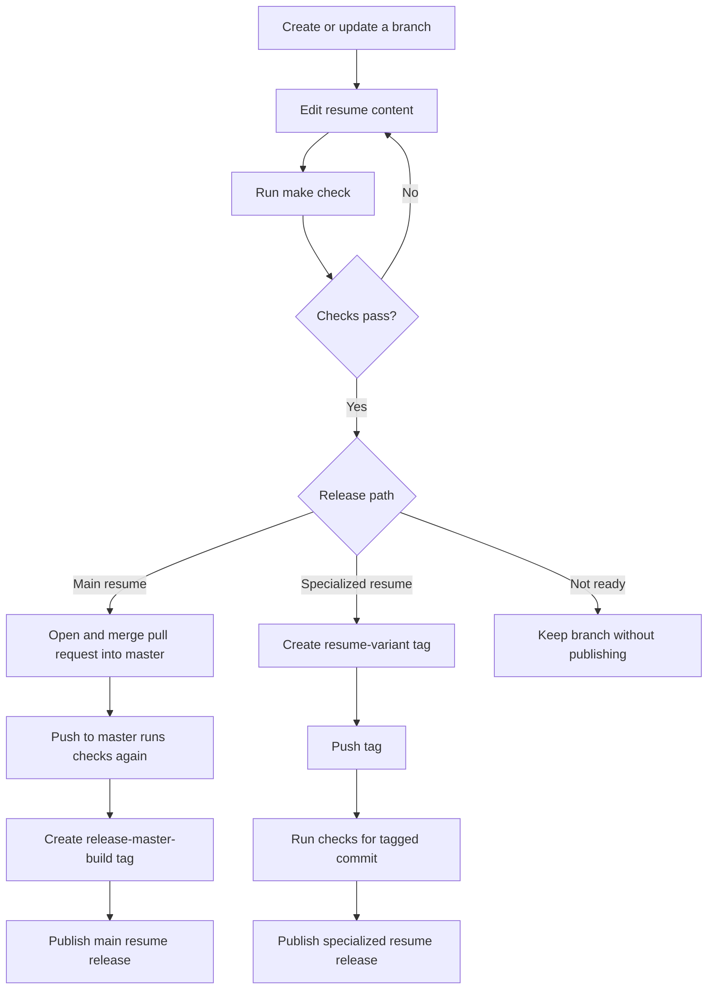

# Release Management

This document describes how Resume Tracker validates changes and publishes main and specialized resume releases.

## Core policy

The project has two release paths:

1. A successful push to `master`, normally produced by merging a pull request, automatically publishes the main resume.
2. A pushed tag beginning with `resume-` publishes a specialized resume from any branch.

Opening a branch or pull request never publishes a PDF. Specialized branches can remain separate from `master` indefinitely.

## Workflow behavior

The workflow is defined in `.github/workflows/resume.yml`.

| Event | Lint and compile | Upload PDF artifact | Create tag and release |
| --- | --- | --- | --- |
| Pull request targeting `master` | Yes | No | No |
| Push to `master` | Yes | Yes | Yes, as `release-master-<run-number>` |
| Manual workflow run from a branch | Yes | No | No |
| Push of a tag matching `resume-*` | Yes | Yes | Yes, using the pushed tag |
| Push of any other tag | No | No | No |

All releases depend on successful linting, compilation, PDF verification, and configured layout checks.

## Release lifecycle



## Main resume releases

A push to `master` starts the validation workflow. If every check succeeds, GitHub Actions creates a release tag using the workflow build number:

```text
release-master-<run-number>
```

For example, workflow run number `42` creates:

- Git tag: `release-master-42`
- Release title: `Resume - release-master-42`
- Workflow artifact: `Sumedh_S_Bhat-master`
- Release PDF: `Sumedh_S_Bhat-release-master-42.pdf`

Git tags reference commits rather than branches. The generated tag points to the exact `master` commit that passed the workflow.

A GitHub release must reference a tag, so `gh release create` creates the build-numbered tag as part of creating the release. If validation fails, neither the master release nor its release tag is created.

The GitHub workflow run number is repository-wide for the **Resume** workflow. It is not a separate counter maintained by Git for each branch. Since automatic build-number releases are limited to `master`, the number still uniquely identifies the publishing workflow run.

## Specialized resume releases

Use a separate branch for a resume aimed at a specific role:

```sh
git switch -c resume/cybersecurity
```

Make the required changes and validate them:

```sh
make check
```

Commit and push the branch through the normal Git workflow. When the exact commit should be published, create an annotated `resume-*` tag:

```sh
git tag -a resume-cybersecurity-v1 -m "Cybersecurity resume v1"
git push origin resume-cybersecurity-v1
```

Pushing the tag starts the release workflow even if `resume/cybersecurity` has not been merged into `master`.

For `resume-cybersecurity-v1`, the workflow creates:

- Git tag: `resume-cybersecurity-v1`, using the tag that was pushed
- Release title: `Resume - resume-cybersecurity-v1`
- Workflow artifact: `Sumedh_S_Bhat-resume-cybersecurity-v1`
- Release PDF: `Sumedh_S_Bhat-resume-cybersecurity-v1.pdf`

## Specialized tag naming

Specialized release tags must begin with `resume-`.

Recommended format:

```text
resume-<variant>-v<version>
```

Examples:

- `resume-cybersecurity-v1`
- `resume-frontend-v2`
- `resume-backend-v1`

Use a new versioned tag for each specialized update. Do not move or reuse a tag that already has a published release. Spelling in the release name comes directly from the tag, so verify it before pushing.

## Correcting an unpublished specialized tag

If a specialized tag has not been pushed, delete it locally and create the corrected tag:

```sh
git tag -d resume-cybersecuirty-v1
git tag -a resume-cybersecurity-v1 -m "Cybersecurity resume v1"
```

Do not rewrite a tag after it has created a public release. Create a new versioned tag instead.

## When a release is not created

For a main release, confirm that:

1. The intended change reached `master`.
2. The **Resume** workflow completed successfully for the resulting push.
3. LaTeX linting, compilation, PDF verification, and layout checks passed.

For a specialized release, also confirm that:

1. The tag begins with `resume-`.
2. The tag was pushed to the remote repository.
3. The tag points to the intended branch commit.

The release job requires permission to write repository contents. A failed validation prevents release creation so a broken resume is not published.
